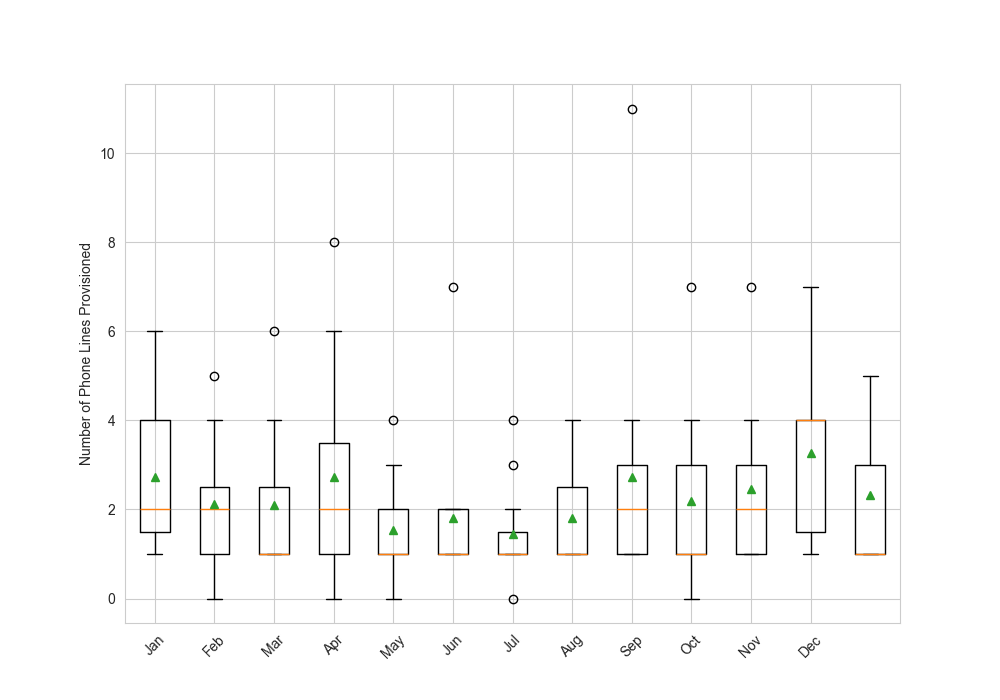

## 6. Anomalies & Outliers

### Aggregarated monthly Phone Lines Distribution

-Each record in the dataset corresponds to the last day of the month. 
However, using monthly_demand_info(), we observe two instances for February: one ending on the 28th and another on the 29th (leap year). 

To ensure data consistency, we will treat all records for the same month as belonging to that month, ignoring the day.

-Here we observe five months with zero instances of phone lines provisioned. This is not an input error; since these occurrences are confined to a single year, it is likely due to operational factors. This assumption is strengthened by the fact that it only happens within that year, and interactions between the call centre and  client industries during those months still took place.

---

- No missing values were found in the dataset.

- Zero values for the number of phone lines occur over a single year across several months. This may indicate a reporting issue, manual input error, or a temporary shift in communication infrastructure (e.g., use of VoIP or other digital channels).

- Importantly, this is not considered an operational anomaly, since other communication channels remained active during these months and call volumes continued.

---
